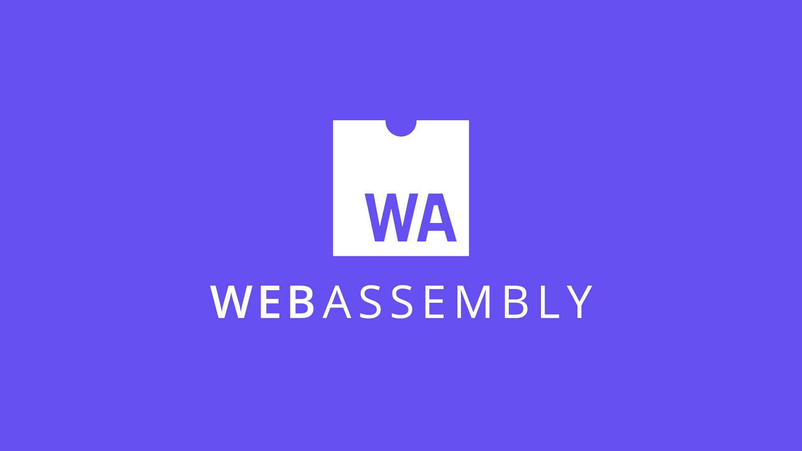

# Web Assembly in Go



## Using Go compiler

Stable

.wasm file size: **1.9M**

```sh
cd wasm
GOOS=js GOARCH=wasm go build -o app.wasm
cd ../
cp $(go env GOROOT)/misc/wasm/wasm_exec.js .
```

## Using TinyGo

Have [issue with .String()](https://github.com/tinygo-org/tinygo/issues/1140)

.wasm file size: **247K size**

```sh
cd wasm
GOOS=js GOARCH=wasm tinygo build -o app.wasm
cd ../
cp $(tinygo env TINYGOROOT)/targets/wasm_exec.js .
```

## Start a Web Server

Starting web server on [http://localhost:8080](http://localhost:8080)

```sh
cd webserver
go run main.go
```
